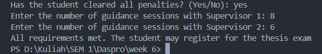
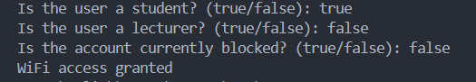

# JOBSHEET 5  - SELECTION 2

**Student Identity:**
* **Name:** Datu Ayu Fitria Caesa
* **Student ID (NIM):** 2641070720087
* **Class / Attendance No.:** 1I / 06

---

## 1: PRACTICUM OBJECTIVES

The objectives of conducting this practicum are:

1. Students are able to understand the basic concepts of selection structures (*conditional statements*).
2. Students are able to implement `if`, `if-else`, and `switch-case` statements in Java.
3. Students are able to analyze the flow of execution in branching logic.

---

## 2: EXPERIMENT RESULTS & ANALYSIS

### 2.1 Experiment 1: Applying the Nested IF Structure

In the first experiment, students are tasked with implementing a nested selection structure (*Nested IF*) to validate thesis exam registration eligibility based on penalty clearance and guidance quotas.

#### 2.1.1 Java Source Code
```java
import java.util.Scanner;

public class NestedThesisExam06 {
    public static void main(String[] args) {
        Scanner sc = new Scanner(System.in);
        String message;

        System.out.print("Has the student cleared all penalties? (Yes/No): ");
        String noPenalty = sc.nextLine().trim();
        System.out.print("Enter the number of guidance sessions with Supervisor 1: ");
        int guidanceCount1 = sc.nextInt();
        System.out.print("Enter the number of guidance sessions with Supervisor 2: ");
        int guidanceCount2 = sc.nextInt();

        if (noPenalty.equalsIgnoreCase("Yes")) {
            if (guidanceCount1 >= 8 && guidanceCount2 >= 4) {
                message = ("All requirements met. The student may register for the thesis exam");
            } else if (guidanceCount1 < 8 && guidanceCount2 < 4) {
                message = ("Failed! Guidance sessions with Supervisor 1 are below 8 and Supervisor 2 are below 4");
            } else if (guidanceCount1 < 8) {
                message = ("Failed! Guidance sessions with Supervisor 1 have not reached 8");
            } else {
                message = ("Failed! Guidance sessions with Supervisor 2 have not reached 4");
            }
        } else {
            message = "Failed! The student still has an outstanding penalty";
        }
        System.out.println(message);
    }
}
```

#### 2.1.2 Execution Results / Output Screenshot
The following is the program output after execution:



#### 2.1.3 Answers to Questions / Reflection Questions
* **Question 1:** What happens if the student answers "No" to the penalty-clearance question? Why?
  * **Answer:** If the student answers "No", the program outputs `"Failed! The student still has an outstanding penalty"`. This occurs because the outer `if` statement checks whether `noPenalty.equalsIgnoreCase("Yes")`; since answering "No" evaluates to `false`, the program bypasses the inner guidance session evaluations entirely and executes the `else` branch on lines 25–27.
* **Question 2:** Explain the meaning of the following code snippet! `if (guidanceCount1 >= 8 && guidanceCount2 >= 4) {`
  * **Answer:** This condition checks whether the student has completed at least 8 guidance sessions with Supervisor 1 (`guidanceCount1 >= 8`) and at least 4 guidance sessions with Supervisor 2 (`guidanceCount2 >= 4`). By using the logical AND operator (`&&`), both criteria must be met simultaneously for the condition to evaluate to `true`, qualifying the student to register for the thesis exam.
* **Question 3:** Describe the full flow of checking the student's requirements from start to finish. Explain step by step for every condition!
  * **Answer:** The evaluation flow starts by reading the inputs and testing the primary condition at line 15; if `noPenalty` is anything other than `"Yes"`, it immediately branches to the outer `else` at lines 25–27 with an outstanding penalty failure. If `"Yes"`, it proceeds to the nested guidance checks: it first verifies if both session requirements are satisfied (`guidanceCount1 >= 8 && guidanceCount2 >= 4`) at line 16 to grant registration approval; if not, it checks whether both supervisors fall short (`guidanceCount1 < 8 && guidanceCount2 < 4`) at line 18; if that is false, it checks whether only Supervisor 1 falls short (`guidanceCount1 < 8`) at line 20; and finally, if Supervisor 1 met the requirement, the inner `else` at lines 22–24 catches the remaining case where only Supervisor 2 is below quota, concluding by printing the resulting message at line 28.

---

### 2.2 Experiment 2: Applying Logical Operators

This experiment focuses on using logical operators (`||`, `&&`, and `!`) to determine campus WiFi access rights based on user role and account blockage status.

#### 2.2.1 Java Source Code
```java
import java.util.Scanner;

public class LogicalOperatorWifi06 {
    public static void main(String[] args) {
        Scanner sc = new Scanner(System.in);
        boolean isStudent;
        boolean isLecturer;
        boolean isBlocked;

        System.out.print("Is the user a student? (true/false): ");
        isStudent = sc.nextBoolean();
        System.out.print("Is the user a lecturer? (true/false): ");
        isLecturer = sc.nextBoolean();
        System.out.print("Is the account currently blocked? (true/false): ");
        isBlocked = sc.nextBoolean();

        if ((isStudent || isLecturer) && !isBlocked) {
            System.out.println("WiFi access granted");
        } else {
            System.out.println("WiFi access denied");
        }
    }
}
```

#### 2.2.2 Execution Results / Output Screenshot
The following is the program output after execution:



#### 2.2.3 Answers to Questions / Reflection Questions
* **Question 1:** Explain the function of the `||`, `&&`, and `!` operators in the condition above.
  * **Answer:** In line 16, the `||` (OR) operator checks whether the user is either a student or a lecturer (evaluating to `true` if at least one role is valid); the `!` (NOT) operator inverts the value of `isBlocked` so that an unblocked account (`false`) becomes `true`; and the `&&` (AND) operator combines both checks, ensuring access is granted only if the user has a valid role and their account is not blocked.
* **Question 2:** Why can a lecturer still get access when `isStudent = false`?
  * **Answer:** Because the expression `isStudent || isLecturer` uses the logical OR operator, which only requires one operand to be `true` for the whole condition to pass. Even though `isStudent` is `false`, having `isLecturer = true` makes `(false || true)` evaluate to `true`, allowing the lecturer to obtain access as long as `isBlocked` is `false`.
* **Question 3:** Change `||` to `&&`. Run the program again using test data 1 and 2. What happens, and why?
  * **Answer:** Both Test Data 1 (student: `true`, lecturer: `false`, blocked: `false`) and Test Data 2 (student: `false`, lecturer: `true`, blocked: `false`) will output `"WiFi access denied"`. This happens because the `&&` operator requires both operands to be `true` simultaneously; since a person is only a student or only a lecturer in those tests, `isStudent && isLecturer` evaluates to `false`, causing the access check to fail.
* **Question 4:** In the expression `isStudent || isLecturer`, when does `isLecturer` not need to be evaluated? Explain using short-circuit evaluation.
  * **Answer:** In `isStudent || isLecturer`, the variable `isLecturer` is skipped whenever `isStudent` is `true`. Through short-circuit evaluation, Java knows that an OR (`||`) expression is guaranteed to be true as soon as its first operand is `true`, so it does not waste time evaluating the second operand.
* **Question 5:** In the expression `(isStudent || isLecturer) && !isBlocked`, when does `!isBlocked` not need to be evaluated? Explain.
  * **Answer:** The expression `!isBlocked` is skipped whenever `(isStudent || isLecturer)` evaluates to `false` (meaning the user is neither a student nor a lecturer). Due to short-circuit evaluation with the `&&` operator, if the left-hand operand is already `false`, the entire expression can never be `true`, so Java immediately concludes the condition is `false` without checking `!isBlocked`.

---

### 2.3 Experiment 3: Combining Nested IF and Logical Operators

This experiment focuses on combining the *Nested IF* structure with logical operators to determine laboratory access permissions in a hierarchical manner.

#### 2.3.1 Java Source Code
```java
import java.util.Scanner;

public class NestedLabAccess06 {
    public static void main(String[] args) {
        Scanner sc = new Scanner(System.in);
        boolean isActiveStudent;
        boolean isSanctioned;
        boolean hasLecturerPermit;
        boolean isLabAssistant;

        System.out.println("Is the user an active student? (true/false): ");
        isActiveStudent = sc.nextBoolean();
        System.out.println("Is the user sanctioned? (true/false): ");
        isSanctioned = sc.nextBoolean();
        System.out.println("Does the user have a lecturer permit? (true/false): ");
        hasLecturerPermit = sc.nextBoolean();
        System.out.println("Is the user a lab assistant? (true/false): ");
        isLabAssistant = sc.nextBoolean();

        if (isActiveStudent && !isSanctioned) {
            if (hasLecturerPermit || isLabAssistant) {
                System.out.println("Laboratory access granted");
            } else {
                System.out.println("Access denied: lecturer permission or lab assistant status required");
            }
        } else {
            System.out.println("Access denied: student status does not meet the requirement");
        }
    }
}
```

#### 2.3.2 Execution Results / Output Screenshot
The following is the program output after execution:


#### 2.3.3 Answers to Questions / Reflection Questions
* **Question 1:** Why is the check `hasLecturerPermit || isLabAssistant` placed inside the first IF?
  * **Answer:** It is placed inside the first condition at line 20 because being an active student without any sanctions is the baseline prerequisite for using the lab. Placing the secondary authorization check inside creates a logical hierarchy, ensuring that permit or assistant credentials are only considered once basic student eligibility has been confirmed.
* **Question 2:** Explain the function of the `&&`, `||`, and `!` operators in this program.
  * **Answer:** The `&&` (AND) operator in line 20 requires both primary conditions to be met simultaneously (being active and having no sanctions); the `!` (NOT) operator inverts `isSanctioned` so that having no sanctions (`false`) evaluates to `true`; and the `||` (OR) operator in line 21 allows entry if at least one qualification is met—either having a lecturer permit or serving as a lab assistant.
* **Question 3:** Can the access requirement be written as a single condition: `isActiveStudent && !isSanctioned && (hasLecturerPermit || isLabAssistant)`? Explain whether the final access decision stays the same.
  * **Answer:** Yes, writing the condition as `isActiveStudent && !isSanctioned && (hasLecturerPermit || isLabAssistant)` yields the exact same final access decision for granting entry. Logically, the student must still satisfy the baseline status requirements along with at least one authorization role, though doing this with a simple `if-else` loses the ability to easily provide specific denial messages for each stage.
* **Question 4:** What is the advantage of using Nested IF in this case, compared to a single IF, if the system needs to show different reasons for denial?
  * **Answer:** The primary advantage is providing specific, detailed feedback to the user depending on where they failed. A nested structure separates failure of fundamental student eligibility (handled at lines 26–28) from failure of special authorization (handled at lines 23–25), whereas a single `if-else` would lump every rejection into one generic error message.
* **Question 5:** Create one input combination that causes access to be denied at the first level, and one that causes it to be denied at the second level.
  * **Answer:** To be denied at the first level, enter `isActiveStudent = true`, `isSanctioned = true`, `hasLecturerPermit = true`, and `isLabAssistant = true` (fails because the student has a sanction). To be denied at the second level, enter `isActiveStudent = true`, `isSanctioned = false`, `hasLecturerPermit = false`, and `isLabAssistant = false` (passes student eligibility, but fails authorization).

---

## 3: INDEPENDENT ASSIGNMENT

The following is the assignment task completed in this Jobsheet:

- [x] **Task 2:** Create a lab-assistant candidate selection system using nested selection (*Nested IF*) and logical operators (`Task2AssistantSelection06.java`).

### 3.1 Task Code Implementation

```java
import java.util.Scanner;

public class Task2AssistantSelection06 {
    public static void main(String[] args) {
        Scanner sc = new Scanner(System.in);

        System.out.print("Is the student active? (true/false): ");
        boolean isActiveStudent = sc.nextBoolean();
        System.out.print("Is the student currently under academic sanction? (true/false): ");
        boolean isSanctioned = sc.nextBoolean();

        if (isActiveStudent && !isSanctioned) {
            System.out.print("Enter Basic Programming grade: ");
            double programmingGrade = sc.nextDouble();
            System.out.print("Does the student have a programming competency certificate? (true/false): ");
            boolean hasCertificate = sc.nextBoolean();

            if (programmingGrade >= 80 || hasCertificate) {
                System.out.println("-> The student meets the requirements and is called for an interview.");
                System.out.print("Enter interview score: ");
                double interviewScore = sc.nextDouble();

                if (interviewScore >= 75) {
                    System.out.println("Selection Result: Accepted as a lab assistant.");
                } else {
                    System.out.println("Selection Result: Failed (interview score is below 75).");
                }
            } else {
                System.out.println("Selection Result: Failed (Basic Programming grade is below 80 and does not possess a programming competency certificate).");
            }
        } else {

            if (!isActiveStudent && isSanctioned) {
                System.out.println("Selection Result: Failed (student status is not active and currently under academic sanction).");
            } else if (!isActiveStudent) {
                System.out.println("Selection Result: Failed (student status is not active).");
            } else {
                System.out.println("Selection Result: Failed (student is currently under academic sanction).");
            }
        }
    }
}
```

---

## 4: CONCLUSION

From the experiments conducted with `NestedThesisExam06.java`, `LogicalOperatorWifi06.java`, `NestedLabAccess06.java`, and the implementation in `Task2AssistantSelection06.java`, it can be concluded that nested selection structures (`nested if`) and logical operators (`&&`, `||`, `!`) are essential for managing complex, multi-stage decision-making logic in Java. Nested selection allows programs to evaluate requirements hierarchically, ensuring that subsequent criteria and inputs are only processed when baseline prerequisites are satisfied, while also enabling the system to deliver precise, stage-specific feedback whenever a requirement fails. Furthermore, logical operators streamline compound conditions, and Java’s short-circuit evaluation optimizes execution efficiency by skipping redundant evaluations once the outcome is determined.
